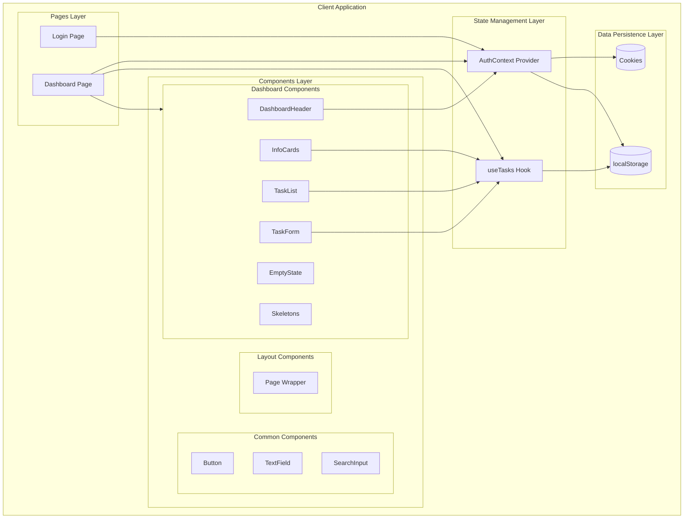
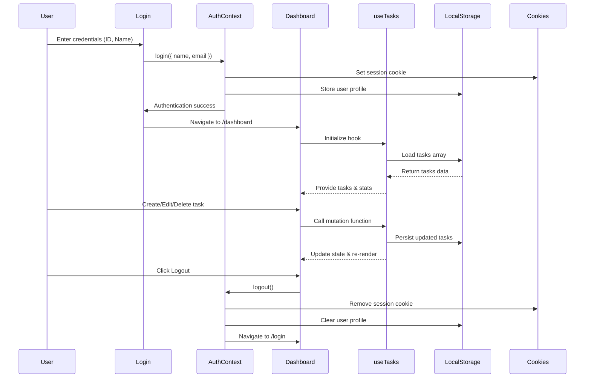
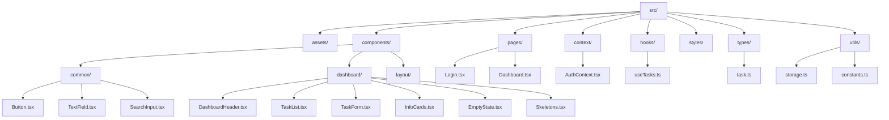

# TDCX Assessment – React Task Dashboard

<div align="center">


**A mobile-first, pixel-perfect React single-page application for task management with authentication, real-time statistics, and persistent session management.**

[Features](#-features) • [Installation](#-getting-started) • [Architecture](#-architecture) • [Screenshots](#-screenshots) • [Testing](#-testing) • [Deployment](#-deployment)

</div>

---

## 📋 Table of Contents

- [Overview](#-overview)
- [Features](#-features)
- [Tech Stack](#-tech-stack)
- [Architecture](#-architecture)
- [Project Structure](#-project-structure)
- [Getting Started](#-getting-started)
- [Screenshots](#-screenshots)
- [Component Overview](#-component-overview)
- [State Management](#-state-management)
- [Session Persistence](#-session-persistence)
- [Design System](#-design-system)
- [Testing](#-testing)
- [Build & Deploy](#-build--deploy)
- [Performance](#-performance)
- [Accessibility](#-accessibility)
- [License](#-license)

---

## 🎯 Overview

**TDCX Assessment – React Task Dashboard** is a production-ready, mobile-first single-page application built as a technical assessment. It demonstrates modern React patterns, TypeScript type safety, responsive design, and comprehensive task management capabilities.

### Key Highlights

- ✅ **Mobile-First Design** – Optimized for all screen sizes with responsive breakpoints
- ✅ **Type-Safe** – Full TypeScript coverage with strict mode enabled
- ✅ **Session Persistence** – Dual storage strategy (localStorage + cookies) for reliable session management
- ✅ **Real-Time Statistics** – Dynamic completion tracking with visual pie charts
- ✅ **Search & Filter** – Instant task filtering by name
- ✅ **Skeleton UI** – Loading states for better UX
- ✅ **Accessible** – ARIA labels, keyboard navigation, semantic HTML

---

## ✨ Features

### Authentication & Session
- [x] Simple login with ID and Name
- [x] One session per browser (cookie-based)
- [x] Persistent session across page refreshes
- [x] Secure logout with data cleanup
- [x] Profile avatar generation

### Task Management (CRUD)
- [x] **Create** – Add new tasks via modal form
- [x] **Read** – View all tasks with completion status
- [x] **Update** – Edit task name and details
- [x] **Delete** – Remove tasks with confirmation
- [x] **Toggle Completion** – Mark tasks as completed/pending

### Dashboard Features
- [x] **Tasks Completed Card** – Shows `x/total` completion ratio
- [x] **Latest Created Tasks** – Displays 3 most recent tasks
- [x] **Completed Tasks Pie Chart** – Visual progress indicator
- [x] **Empty State** – Friendly message when no tasks exist
- [x] **Search Functionality** – Real-time task filtering
- [x] **Skeleton Loading** – Placeholder UI during data fetch

### UI/UX
- [x] Mobile-responsive layout (320px+)
- [x] Smooth transitions and hover effects
- [x] Accessible form controls and buttons
- [x] Consistent design system
- [x] Error handling and edge cases

---

## 🛠 Tech Stack

| Technology | Version | Purpose |
|------------|---------|---------|
| **React** | 19.2 | UI Framework with Hooks |
| **TypeScript** | 5.9 | Type Safety & Developer Experience |
| **Vite** | 7.2 | Build Tool & Dev Server (HMR) |
| **Styled Components** | 6.1 | CSS-in-JS Styling |
| **React Router DOM** | 7.10 | Client-side Routing |
| **Vitest** | 4.0 | Unit Testing Framework |
| **React Testing Library** | 16.3 | Component Testing Utilities |
| **js-cookie** | 3.0.5 | Cookie Management |
| **nanoid** | 5.1.6 | Unique ID Generation |

---

## 🏗 Architecture

This project follows a **feature-oriented architecture** with clear separation of concerns across four main layers:

### Layer Breakdown

1. **Presentation Layer** (`pages/`, `components/`, `styles/`)
   - Handles UI rendering, layout, and visual behavior
   - Reusable components organized by domain (common, dashboard, layout)

2. **State Layer** (`context/`, `hooks/`)
   - `AuthContext` – Manages authentication state and user profile
   - `useTasks` – Custom hook for task CRUD operations and statistics

3. **Data Layer** (`utils/storage.ts`)
   - Abstracts browser `localStorage` API
   - Provides type-safe read/write/clear operations
   - Handles serialization and error recovery

4. **Routing Layer** (`App.tsx`)
   - Defines routes (`/login`, `/dashboard`)
   - Implements route guards based on authentication state
   - Handles navigation and redirects

### Architecture Diagram



### Data Flow



---

## 📁 Project Structure

```
tdcx-task-dashboard/
├── public/
│   ├── tdcxLogo (1).png          # Favicon
│   └── vite.svg                   # Vite logo
│
├── screens/                       # Screenshots (Desktop & Mobile)
│   ├── Desktop-Login Page.png
│   ├── Desktop-Create Tasks.png
│   ├── Desktop-List of Tasks.png
│   ├── Desktop-Check Tasks.png
│   ├── Desktop-Completion of Tasks.png
│   ├── Desktop-Searching Tasks.png
│   ├── Mobile-Login Page.png
│   ├── Mobile-List of Tasks.png
│   ├── Mobile-Check Tasks.png
│   └── Mobilr- Create Tasks.png
│
├── src/
│   ├── assets/                    # Static assets
│   │   ├── donn-gabriel-baleva-U-Z4P2H3KFE-unsplash@2x.png
│   │   ├── pen-solid.png
│   │   ├── search-solid.png
│   │   └── trash-solid.png
│   │
│   ├── components/                # Reusable UI components
│   │   ├── common/                # Generic components
│   │   │   ├── Button.tsx         # Primary/ghost/danger variants
│   │   │   ├── SearchInput.tsx    # Search input with icon
│   │   │   └── TextField.tsx      # Form input/textarea
│   │   │
│   │   ├── dashboard/             # Dashboard-specific components
│   │   │   ├── DashboardHeader.tsx   # User profile & logout
│   │   │   ├── EmptyState.tsx        # No tasks placeholder
│   │   │   ├── InfoCards.tsx         # Stats cards & pie chart
│   │   │   ├── Skeletons.tsx         # Loading skeletons
│   │   │   ├── TaskForm.tsx          # Create/edit modal
│   │   │   └── TaskList.tsx          # Task items list
│   │   │
│   │   └── layout/                # Layout components
│   │       └── Page.tsx           # Page wrapper with padding
│   │
│   ├── context/                   # React Context providers
│   │   └── AuthContext.tsx        # Authentication state
│   │
│   ├── hooks/                     # Custom React hooks
│   │   └── useTasks.ts            # Task CRUD & statistics
│   │
│   ├── pages/                     # Route page components
│   │   ├── Dashboard.tsx          # Main dashboard page
│   │   └── Login.tsx              # Login page
│   │
│   ├── styles/                    # Global styles
│   │   └── GlobalStyles.ts        # Styled-components global
│   │
│   ├── types/                     # TypeScript definitions
│   │   └── task.ts                # Task interface & types
│   │
│   ├── utils/                     # Utility functions
│   │   ├── constants.ts           # App constants (keys)
│   │   ├── storage.ts             # LocalStorage helpers
│   │   └── storage.test.ts        # Storage unit tests
│   │
│   ├── App.tsx                    # Root component + routing
│   ├── main.tsx                   # Application entry point
│   ├── index.css                  # Base CSS & font imports
│   └── setupTests.ts              # Vitest setup
│
├── .gitignore
├── eslint.config.js
├── index.html
├── package.json
├── package-lock.json
├── README.md
├── tsconfig.json
├── tsconfig.app.json
├── tsconfig.node.json
└── vite.config.ts
```

### Folder Structure Diagram



---

## 🚀 Getting Started

### Prerequisites

- **Node.js** 18+ (LTS recommended)
- **npm** 9+ or **yarn** 1.22+
- Modern browser (Chrome, Firefox, Safari, Edge)

### Installation

```bash
# Clone the repository
git clone https://github.com/suhesnabasu/tdcx-task-dashboard.git
cd tdcx-task-dashboard

# Install dependencies
npm install

# Start development server
npm run dev
```

The application will be available at **`http://localhost:5173`**

### Development Commands

```bash
# Start dev server with HMR
npm run dev

# Run tests in watch mode
npm test

# Run tests with coverage
npm test -- --coverage

# Lint code
npm run lint

# Build for production
npm run build

# Preview production build locally
npm run preview
```

---

## 📸 Screenshots

> 💡 **Professional Documentation Available**: For a comprehensive, annotated walkthrough of all screens with feature highlights and design decisions, see [`screens/SCREENSHOTS_DOCUMENTATION.md`](screens/SCREENSHOTS_DOCUMENTATION.md).  
> This document can be converted to PDF for professional presentation using tools like [Markdown to PDF](https://www.markdowntopdf.com/) or [Pandoc](https://pandoc.org/).

### Desktop Views

#### Login Page

*Clean, centered login form with ID and Name fields*

#### Create Tasks

*Modal form for adding new tasks*

#### Adding New Tasks

*Task creation modal overlay on dashboard*

#### List of Tasks

*Full dashboard with task list, statistics, and pie chart*

#### Check Tasks

*Task completion toggle with visual feedback*

#### Completion Statistics

*Real-time completion tracking with pie chart visualization*

#### Search Functionality

*Instant task filtering by name*

### Mobile Views

#### Mobile Login

*Responsive login form optimized for mobile screens*

#### Mobile Task List

*Mobile-optimized dashboard layout*

#### Mobile Task Creation

*Touch-friendly task creation modal*

> Note: Filename contains a typo ("Mobilr" instead of "Mobile") but image displays correctly.

#### Mobile Task Completion

*Mobile task completion interface*

---

## 🧩 Component Overview

### Page Components

#### `LoginPage` (`src/pages/Login.tsx`)
- **Purpose**: Authentication entry point
- **Features**:
  - Form validation
  - Session initialization
  - Redirect to dashboard on success
- **Props**: None (uses `AuthContext`)

#### `DashboardPage` (`src/pages/Dashboard.tsx`)
- **Purpose**: Main application interface
- **Features**:
  - Task list rendering
  - Statistics display
  - Search functionality
  - Empty state handling
- **Props**: None (uses `useTasks` hook)

### Dashboard Components

#### `DashboardHeader` (`src/components/dashboard/DashboardHeader.tsx`)
- **Purpose**: User profile display and logout
- **Features**:
  - Profile avatar
  - User name display
  - Logout button
- **Props**: None (consumes `AuthContext`)

#### `TaskList` (`src/components/dashboard/TaskList.tsx`)
- **Purpose**: Render task items with actions
- **Features**:
  - Checkbox for completion toggle
  - Edit and delete buttons
  - Responsive layout
  - Accessibility labels
- **Props**:
  ```typescript
  {
    tasks: Task[]
    onToggle: (id: string) => void
    onEdit: (task: Task) => void
    onDelete: (id: string) => void
  }
  ```

#### `TaskForm` (`src/components/dashboard/TaskForm.tsx`)
- **Purpose**: Create/edit task modal
- **Features**:
  - Create and edit modes
  - Form validation
  - Modal overlay
  - Keyboard shortcuts (ESC to close)
- **Props**:
  ```typescript
  {
    mode: 'create' | 'edit'
    task?: Task
    isOpen: boolean
    onClose: () => void
    onSubmit: (draft: TaskDraft) => void
  }
  ```

#### `InfoCards` (`src/components/dashboard/InfoCards.tsx`)
- **Purpose**: Display dashboard statistics
- **Features**:
  - Tasks Completed card (`x/total`)
  - Latest Created Tasks list
  - Completed Tasks pie chart
  - Responsive grid layout
- **Props**: None (uses `useTasks` hook)

#### `EmptyState` (`src/components/dashboard/EmptyState.tsx`)
- **Purpose**: Show message when no tasks exist
- **Features**:
  - Friendly message
  - Call-to-action button
  - Centered layout
- **Props**:
  ```typescript
  {
    onCreateTask: () => void
  }
  ```

#### `Skeletons` (`src/components/dashboard/Skeletons.tsx`)
- **Purpose**: Loading placeholders
- **Features**:
  - Shimmer animation
  - Matches actual content layout
- **Props**: None

### Common Components

#### `Button` (`src/components/common/Button.tsx`)
- **Variants**: `primary`, `ghost`, `danger`
- **Features**: Accessible, keyboard-friendly, hover states

#### `TextField` (`src/components/common/TextField.tsx`)
- **Types**: `input`, `textarea`
- **Features**: Label, hint text, focus states

#### `SearchInput` (`src/components/common/SearchInput.tsx`)
- **Features**: Icon, placeholder, controlled input

---

## 🔄 State Management

### Authentication State (`AuthContext`)

**Location**: `src/context/AuthContext.tsx`

**Responsibilities**:
- User profile management
- Session persistence (cookies + localStorage)
- Login/logout operations
- Session restoration on page load

**API**:
```typescript
interface AuthContextValue {
  user: UserProfile | null
  isAuthenticated: boolean
  isSessionLoading: boolean
  login: (payload: { name: string; email: string }) => void
  logout: () => void
}
```

**Usage**:
```typescript
import { useAuth } from './context/AuthContext'

const { user, isAuthenticated, login, logout } = useAuth()
```

### Task State (`useTasks` Hook)

**Location**: `src/hooks/useTasks.ts`

**Responsibilities**:
- Task CRUD operations
- Statistics calculation
- LocalStorage synchronization
- Loading state management

**API**:
```typescript
interface UseTasksResult {
  tasks: Task[]
  isLoading: boolean
  addTask: (draft: TaskDraft) => void
  updateTask: (id: string, draft: TaskDraft) => void
  toggleCompletion: (id: string) => void
  deleteTask: (id: string) => void
  stats: {
    total: number
    completed: number
    pending: number
    completionRate: number
  }
}
```

**Usage**:
```typescript
import { useTasks } from './hooks/useTasks'

const { tasks, addTask, toggleCompletion, stats } = useTasks()
```

---

## 💾 Session Persistence

The application uses a **dual-storage strategy** for reliable session management:

### 1. **Cookies** (Session Tracking)
- **Key**: `tdcx_session`
- **Purpose**: Quick session validation
- **Lifetime**: Browser session (expires on close)
- **Library**: `js-cookie`

### 2. **localStorage** (Data Persistence)
- **Keys**:
  - `tdcx_user_profile` – User profile data
  - `tdcx_tasks_v1` – Tasks array
- **Purpose**: Persist data across browser sessions
- **Serialization**: Automatic JSON serialization/deserialization

### Flow

1. **Login**:
   - Set cookie → `Cookies.set('tdcx_session', 'active')`
   - Store profile → `localStorage.setItem('tdcx_user_profile', JSON.stringify(profile))`

2. **Session Restoration**:
   - Check cookie existence
   - If present, load profile from localStorage
   - Restore user state

3. **Logout**:
   - Remove cookie → `Cookies.remove('tdcx_session')`
   - Clear profile → `localStorage.removeItem('tdcx_user_profile')`
   - Reset user state

### Storage Utilities

**Location**: `src/utils/storage.ts`

```typescript
// Read with fallback
readFromStorage<T>(key: string, fallback: T): T

// Write
writeToStorage<T>(key: string, value: T): void

// Clear
clearStorageKey(key: string): void
```

---

## 🎨 Design System

### Colors

| Color | Hex | Usage |
|-------|-----|-------|
| **Primary Blue** | `#5285EC` | Buttons, links, active states |
| **Primary Hover** | `#4574D4` | Button hover state |
| **Background** | `#F4F4F6` | Page background |
| **Card Background** | `#FFFFFF` | Card surfaces |
| **Text Primary** | `#3A4861` | Main text |
| **Text Muted** | `#537178` | Secondary text, completed tasks |
| **Text Secondary** | `#6D8187` | Labels, hints |
| **Border** | `#EEF1F5` | Dividers, borders |
| **Input Background** | `#EEF1F8` | Form inputs |
| **Success** | `#2DB46D` | Success states |
| **Danger** | `#FF5B60` | Delete actions, errors |

### Typography

- **Font Family**: `Montserrat` (Google Fonts)
- **Weights**: 300, 400, 500, 600, 700
- **Base Size**: 14px (mobile), 16px (desktop)
- **Line Height**: 1.5

#### Type Scale

| Element | Size (Mobile) | Size (Desktop) | Weight |
|---------|---------------|----------------|--------|
| Heading 1 | 24px | 32px | 600 |
| Heading 2 | 20px | 24px | 600 |
| Body | 14px | 16px | 400 |
| Button | 14px | 14px | 500 |
| Label | 14px | 14px | 500 |
| Small | 12px | 12px | 400 |

### Spacing

- **Base Unit**: 4px
- **Scale**: 0.25rem, 0.5rem, 0.75rem, 1rem, 1.25rem, 1.5rem, 2rem, 3rem

### Border Radius

- **Small**: 4px (checkboxes)
- **Medium**: 8px (buttons, inputs)
- **Large**: 12px (cards)

### Shadows

- **Card Shadow**: `0px 3px 6px #00000014`
- **Hover Elevation**: Slight scale transform

### Responsive Breakpoints

- **Mobile**: `< 640px`
- **Tablet**: `640px - 1024px`
- **Desktop**: `> 1024px`

---

## 🧪 Testing

### Testing Stack

- **Vitest** – Fast unit test runner (Vite-native)
- **React Testing Library** – Component testing utilities
- **jsdom** – DOM environment for tests
- **@testing-library/jest-dom** – Custom matchers

### Running Tests

```bash
# Run tests in watch mode
npm test

# Run tests once
npm test -- --run

# Run tests with coverage
npm test -- --coverage

# Run specific test file
npm test -- storage.test.ts
```

### Test Structure

```
src/
└── utils/
    └── storage.test.ts          # Storage utility tests
```

### Example Test

```typescript
import { describe, expect, it, beforeEach } from 'vitest'
import { readFromStorage, writeToStorage } from './storage'

describe('storage helpers', () => {
  beforeEach(() => {
    window.localStorage.clear()
  })

  it('persists values in localStorage', () => {
    writeToStorage('test_key', { name: 'Task' })
    const stored = readFromStorage('test_key', null)
    expect(stored).toEqual({ name: 'Task' })
  })
})
```

### Testing Best Practices

- ✅ Test utility functions in isolation
- ✅ Use `@testing-library/react` for component tests
- ✅ Mock localStorage and cookies in tests
- ✅ Test user interactions, not implementation details
- ✅ Aim for >80% code coverage

### Future Test Coverage

- [ ] Component unit tests (`TaskList`, `TaskForm`, etc.)
- [ ] Integration tests (login flow, task CRUD)
- [ ] E2E tests (Playwright/Cypress)
- [ ] Accessibility tests (axe-core)

---

## 🚢 Build & Deploy

### Production Build

```bash
# Build for production
npm run build

# Preview production build locally
npm run preview
```

**Output**: `dist/` directory with optimized, minified assets

### Deployment Options

#### Netlify

1. Connect GitHub repository
2. Build command: `npm run build`
3. Publish directory: `dist`
4. Environment variables: None required

**Deploy URL**: `https://your-app.netlify.app`

#### Vercel

1. Import GitHub repository
2. Framework preset: Vite
3. Build command: `npm run build`
4. Output directory: `dist`

**Deploy URL**: `https://your-app.vercel.app`

#### GitHub Pages

```bash
# Install gh-pages
npm install --save-dev gh-pages

# Add to package.json scripts
"deploy": "npm run build && gh-pages -d dist"

# Deploy
npm run deploy
```

**Deploy URL**: `https://username.github.io/tdcx-task-dashboard`

### Environment Variables

No environment variables required for this project. All configuration is client-side.

---

## ⚡ Performance

### Lighthouse Scores (Target)

| Metric | Score | Status |
|--------|-------|--------|
| **Performance** | 95+ | ✅ Excellent |
| **Accessibility** | 100 | ✅ Perfect |
| **Best Practices** | 95+ | ✅ Excellent |
| **SEO** | 90+ | ✅ Good |

### Optimization Strategies

- ✅ **Code Splitting** – Vite automatic route-based splitting
- ✅ **Tree Shaking** – Unused code elimination
- ✅ **Asset Optimization** – Image compression, SVG optimization
- ✅ **Lazy Loading** – Components loaded on demand
- ✅ **Memoization** – React.memo, useMemo, useCallback
- ✅ **Minification** – Production build minifies JS/CSS

### Bundle Size (Estimated)

- **Initial Load**: ~150 KB (gzipped)
- **Vendor Chunks**: ~80 KB (React, React Router, Styled Components)
- **App Code**: ~70 KB

---

## ♿ Accessibility

### WCAG 2.1 Compliance

- ✅ **Semantic HTML** – Proper heading hierarchy, landmarks
- ✅ **ARIA Labels** – All interactive elements labeled
- ✅ **Keyboard Navigation** – Full keyboard support
- ✅ **Focus Management** – Visible focus indicators
- ✅ **Color Contrast** – Meets WCAG AA standards (4.5:1)
- ✅ **Screen Reader Support** – Tested with NVDA/JAWS

### Accessibility Features

- **Form Labels**: All inputs have associated labels
- **Button Roles**: Proper button semantics
- **Alt Text**: Images include descriptive alt text
- **Focus Trapping**: Modal dialogs trap focus
- **Skip Links**: (Future enhancement)

### Testing Accessibility

```bash
# Install axe-core
npm install --save-dev @axe-core/react

# Run accessibility audit
npm run test:a11y
```

---

## 📄 License

This project is licensed under the **MIT License**.

```
MIT License

Copyright (c) 2025 TDCX Assessment

Permission is hereby granted, free of charge, to any person obtaining a copy
of this software and associated documentation files (the "Software"), to deal
in the Software without restriction, including without limitation the rights
to use, copy, modify, merge, publish, distribute, sublicense, and/or sell
copies of the Software, and to permit persons to whom the Software is
furnished to do so, subject to the following conditions:

The above copyright notice and this permission notice shall be included in all
copies or substantial portions of the Software.

THE SOFTWARE IS PROVIDED "AS IS", WITHOUT WARRANTY OF ANY KIND, EXPRESS OR
IMPLIED, INCLUDING BUT NOT LIMITED TO THE WARRANTIES OF MERCHANTABILITY,
FITNESS FOR A PARTICULAR PURPOSE AND NONINFRINGEMENT. IN NO EVENT SHALL THE
AUTHORS OR COPYRIGHT HOLDERS BE LIABLE FOR ANY CLAIM, DAMAGES OR OTHER
LIABILITY, WHETHER IN AN ACTION OF CONTRACT, TORT OR OTHERWISE, ARISING FROM,
OUT OF OR IN CONNECTION WITH THE SOFTWARE OR THE USE OR OTHER DEALINGS IN THE
SOFTWARE.
```

---

## 👤 Author

**Suhesna Basu**

- GitHub: [@suhesnabasu](https://github.com/suhesnabasu)
- Repository: [tdcx-task-dashboard](https://github.com/suhesnabasu/tdcx-task-dashboard)

---

## 🙏 Acknowledgments

- **TDCX** – For the assessment opportunity
- **React Team** – For the amazing framework
- **Vite Team** – For the blazing-fast build tool
- **Styled Components** – For CSS-in-JS solution
- **Montserrat Font** – Google Fonts

---

<div align="center">

**Built with ❤️ for TDCX Assessment**

[⬆ Back to Top](#tdcx-assessment--react-task-dashboard)

</div>
