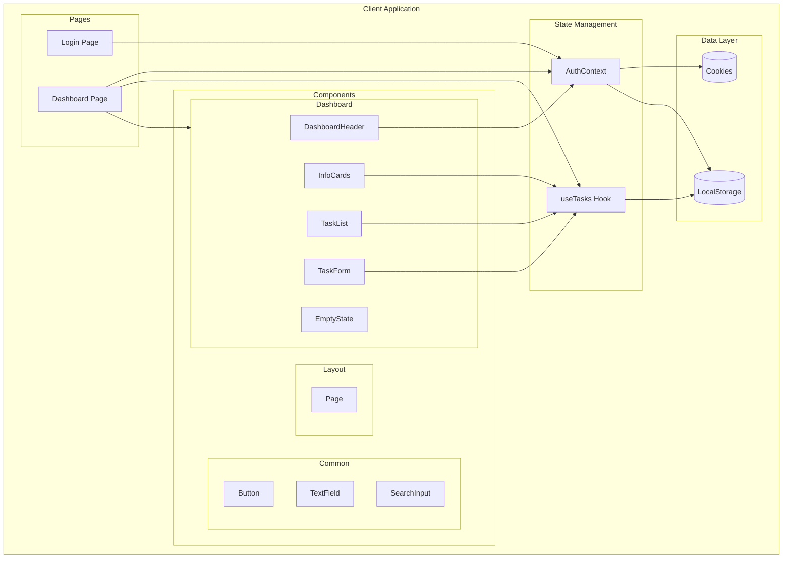
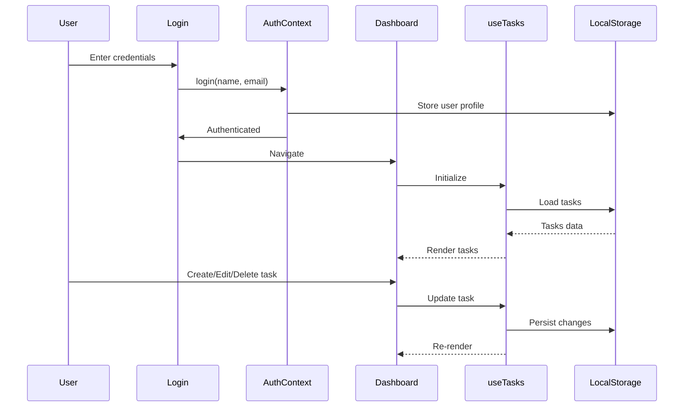

# TDCX Task Dashboard

A modern, responsive task management dashboard built with React, TypeScript, and Vite. Features a clean UI for managing tasks with real-time statistics and visual progress tracking.


## Features

- **User Authentication** - Simple login/logout with session persistence
- **Task Management** - Create, edit, delete, and toggle task completion
- **Dashboard Statistics** - Visual overview with completion counts and pie chart
- **Search & Filter** - Find tasks quickly by name
- **Responsive Design** - Works seamlessly on desktop and mobile
- **Local Storage** - Data persists across browser sessions

## Architecture Overview



## Data Flow



## Tech Stack

| Technology | Purpose |
|------------|---------|
| React 19 | UI Framework |
| TypeScript | Type Safety |
| Vite | Build Tool & Dev Server |
| Styled Components | CSS-in-JS Styling |
| React Router | Client-side Routing |
| js-cookie | Cookie Management |

## Project Structure

```
src/
├── assets/                    # Static assets (images, icons)
│   ├── donn-gabriel-baleva-U-Z4P2H3KFE-unsplash@2x.png  # Profile image
│   ├── pen-solid.png          # Edit icon
│   ├── search-solid.png       # Search icon
│   └── trash-solid.png        # Delete icon
│
├── components/                # Reusable UI components
│   ├── common/                # Generic components
│   │   ├── Button.tsx         # Primary button component
│   │   ├── SearchInput.tsx    # Search input with icon
│   │   └── TextField.tsx      # Form text input
│   │
│   ├── dashboard/             # Dashboard-specific components
│   │   ├── DashboardHeader.tsx   # User profile & logout
│   │   ├── EmptyState.tsx        # No tasks placeholder
│   │   ├── InfoCards.tsx         # Statistics cards & pie chart
│   │   ├── Skeletons.tsx         # Loading skeletons
│   │   ├── TaskForm.tsx          # Create/edit task modal
│   │   └── TaskList.tsx          # Task items list
│   │
│   └── layout/                # Layout components
│       └── Page.tsx           # Main page wrapper
│
├── context/                   # React Context providers
│   └── AuthContext.tsx        # Authentication state management
│
├── hooks/                     # Custom React hooks
│   └── useTasks.ts            # Task CRUD operations hook
│
├── pages/                     # Route page components
│   ├── Dashboard.tsx          # Main dashboard page
│   └── Login.tsx              # Login page
│
├── styles/                    # Global styles
│   └── GlobalStyles.ts        # Styled-components global styles
│
├── types/                     # TypeScript type definitions
│   └── task.ts                # Task interface
│
├── utils/                     # Utility functions
│   ├── constants.ts           # App constants
│   ├── storage.ts             # LocalStorage helpers
│   └── storage.test.ts        # Storage unit tests
│
├── App.tsx                    # Root component with routing
├── main.tsx                   # Application entry point
└── index.css                  # Base CSS styles
```

## Getting Started

### Prerequisites

- Node.js 18+ 
- npm or yarn

### Installation

```bash
# Clone the repository
git clone <repository-url>
cd tdcx-task-dashboard-main

# Install dependencies
npm install

# Start development server
npm run dev
```

The app will be available at `http://localhost:5173`

### Build for Production

```bash
npm run build
npm run preview
```

## Usage

1. **Login** - Enter any ID and name to access the dashboard
2. **Create Task** - Click "+ New Task" button
3. **Complete Task** - Click the checkbox to mark as done
4. **Edit Task** - Click the pencil icon
5. **Delete Task** - Click the trash icon
6. **Search** - Use the search bar to filter tasks

## Recent Updates

### UI Enhancements
- **Profile Avatar** - Now displays profile image from assets
- **Task Icons** - Updated edit/delete icons to use asset images (`pen-solid.png`, `trash-solid.png`)
- **Search Icon** - Updated to use asset image (`search-solid.png`)
- **Completed Task Styling** - Updated text color to `#537178` with strikethrough

### Pie Chart Improvements
- Changed from donut chart to **solid pie chart**
- Added **connecting line** from chart to "Completed Tasks" label
- **Conditional label** - Only shows "Completed Tasks" label when tasks are completed
- Positioned chart on the **left** with legend on the **right**

### Code Quality
- TypeScript strict mode enabled
- Consistent styling with Montserrat font family
- Responsive design for all screen sizes

## Scripts

| Command | Description |
|---------|-------------|
| `npm run dev` | Start development server |
| `npm run build` | Build for production |
| `npm run preview` | Preview production build |
| `npm run lint` | Run ESLint |

## License

MIT License
